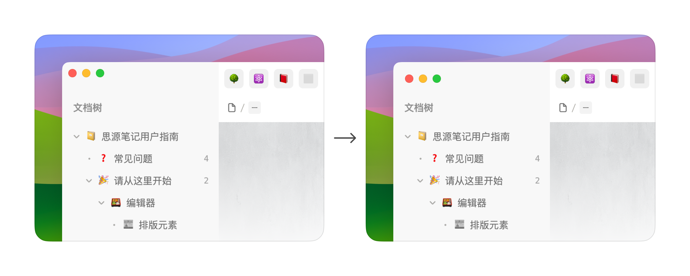

[English](./README_en_US.md)

Hadeeth 是一款极富现代感的类 macOS 主题，以轻量、极简的风格，带来优雅、高效的笔记体验。

## 主题特性

* 🌓 支持亮色模式和暗色模式
* 📐 取消页面区块间的多余间距，扩大展示范围
* 📃 默认隐藏顶栏，获得更多显示空间，优化窗口拖动区域

  * 📌 鼠标移至窗口顶部左侧和右侧有图标的区域，即可弹出顶栏
  * 📌 主窗口用于拖动的区域改为**以下区域的空白部分**：

    * **页签栏**
    * **面包屑**
    * **侧栏面板上部**
* 🗂️ 文档树、大纲缩进参考线
* 🌫️ 引入毛玻璃材质，带来富有层次感的视觉体验
* 🚀 流畅度表现优秀
* 🚥 优化 macOS 红绿灯位置，更具呼吸感

  
* ……

## 鸣谢

主题制作过程中参考借鉴了以下主题的思路，在此对各位主题开发者表示感谢 🙏：

| 借鉴内容                                                               | 来自主题 | 作者 |
| ------------------------------------------------------------------------ | ---------- | ------ |
| 搜索窗口 隐藏顶栏 侧栏面板列表项目前圆点 大纲列表标题图标 状态栏  | [Savor](https://github.com/royc01/notion-theme)         | [Roy](https://github.com/royc01)     |
| 菜单背景模糊                                                           | [Cliff-Dark](https://github.com/chenshinshi/Cliff-Dark)         | [Crowds21](https://github.com/chenshinshi)     |
| 文档树缩进线 DOM 监听的相关 js 代码                                   | [Rem Craft](https://github.com/svchord/Rem-Craft)         | [Seven Chord](https://github.com/svchord)     |

## 其他

* ⚠️ 编辑区内向上拖移块至边界时可能无法触发页面滚动，此时可以用剪切（<kbd>Ctrl/Cmd</kbd> + <kbd>X</kbd>）进行块的移动
* ⚠️ 设置菜单拖移区域仅保留左栏顶部图标和「设置」区域